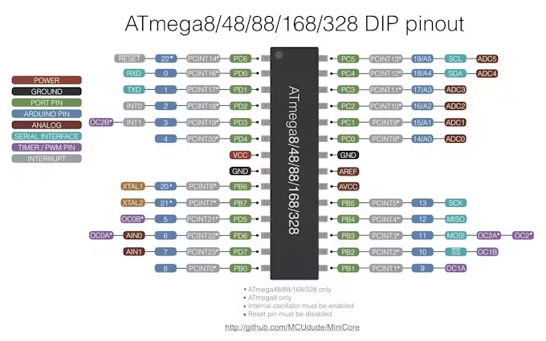

# Interrupt

Interrupts are signals that tell the microcontroller to stop what it is doing and execute a specific function

#### Interrupt divide into 2 types:
- Interal Interrupt: (UART, SPI, I2C, ADC, …) 
- External Interrupt (Use the INT0, INT1 of chip)

## ATmega328P-Pu Pinout

## External Interrupt
It has 3 Register involded to it:
### EICRA (External Interrupt Control Register A)

Interrupt Sense Control (ISC): ISC11, ISC10, ISC01, ISC00

|ISC11|ISC10| Description|
|-----|-----|------------|
|0    |0    | The low level of INT1 generates an interupt request|
|0    |1    | Any logical on INT1 generates an interupt request|
|1    |0    | The falling edge of INT1 generates an interupt request|
|0    |0    | The rising edge of INT1 generates an interupt request|

|IS01|ISC00| Description|
|-----|-----|------------|
|0    |0    | The low level of INT0 generates an interupt request|
|0    |1    | Any logical on INT0 generates an interupt request|
|1    |0    | The falling edge of INT0 generates an interupt request|
|0    |0    | The rising edge of INT0 generates an interupt request|

If we want INT1 is Falling Edge, INT0 is Rising Edge
Set the code `EICRA |= (1 << ISC11) | (1 << ISC01) | (1 << ISC00);`
## EIMSK (External Interrupt Mask Register)

Use to allow to Interrupt in INT1 and INT0 run
Set the code `EIMSK|= (1 << INT1) | (1 << INT0);`

## Global Interrupt Enable bit: sei();
**Must have** this variable. Without which the AVR will simply ignore any and all interrupts

