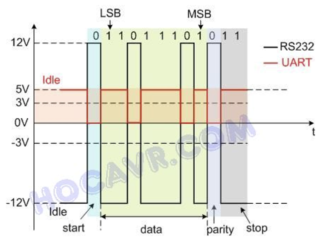
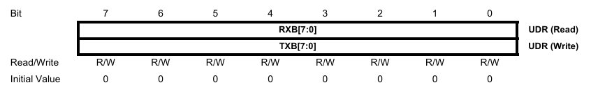
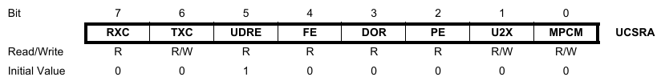
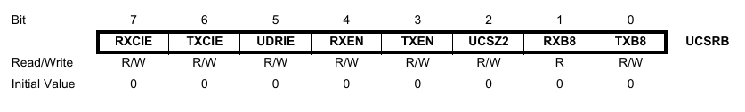
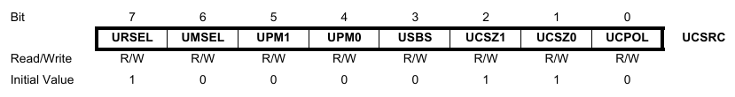

# USART
 - The Universal Synchronous and Asynchronous serial Receiver and Transmitter (USART) is a highly-flexible serial communication device.
  
 - With Asynchronous Serial Communication, because of prone to data loss or corruption, the communication process in this type must follow certain specifications:
  
   - **Baud rate:** 2 device dominating each other in terms of transmission speed. 
     - Ex: 9600 -> in 1 second, 9600 bit is transmited
      
   - **Frame:** 
   
    

     - Acccording to upper image, it have:
       - **Start bit:** **Must have** in frame transmission, the first bit in frame, has the function of alerting the receiving device that a data packet is about to be transmitted.
       - **Data bit:** has 2 kind of bit: (LSB – Least Significant Bit, MSB – Most Significant Bit) can be 5, 6, 7, 8 or 9 depends on your regulations.
       - **Parity bit:** has 2 kind of bit: Odd and Even
       - **Stop bit:** is one or more bits that tells the receiving device that a data packet has been sent. After receiving the stop bits, the receiving device will check the transmission frame to ensure the accuracy of the data. In AVR USART it can be 1 or 2 bits (For example in the picture there are 2 Stop bits).
  ## Register Description
  - ### UDR– USART I/O Data Register
  - 
       
      The data register is an 8-bit register that contains the received and detected value of the USART. Write the value to a compatible UDR, place the value in a buffer register, and prepare it for sending
  - ### UCSRA – USART Control and Status Register A
   
     

    - `Bit 7 – RXC USART Receive Complete:` This flag bit is set when there are unread data in the receive buffer and cleared when the receive buffer is empty
    - `Bit 6 – TXC. USART Transmit Complete:` This flag bit is set when the entire frame in the Transmit Shift Register has been shifted out and there are no new data currently present in the transmit buffer (UDR).
    - `Bit 5 – UDRE.` USART Data Register Empty: If UDRE is one, the buffer is empty, and therefore ready to be written
  - ### UCSRB – USART Control and Status Register B
   
     

    - `Bit 7 – RXCIE. RX Complete Interrupt Enable`
    - `Bit 6 – TXCIE. TX Complete Interrupt Enable`
    - `Bit 5 – UDRIE. USART Data Register Empty Interrupt Enable`
    - `Bit 4 – RXEN. Receiver Enable`
    - `Bit 3 – TXEN. Transmitter Enable`
    - `Bit 2 – UCSZ2. Character Size`
    - `Bit 1 – RXB8. Receive Data Bit 8`
    - `Bit 0 – TXB8. Transmit Data Bit 8`
  - ### UCSRC – USART Control and Status Register C
    

    - `Bit 7 – URSEL. Register Select:` This bit selects between accessing the UCSRC or the UBRRH Register. It is read as one when reading UCSRC. The URSEL must be one when writing the UCSRC
    - `Bit 6 – UMSEL. USART Mode Select:` This bit selects between Asynchronous and Synchronous mode of operation.
        |UMSEL| Mode        |
        |-----|-------------|
        |0    | Asynchronous|
        |1    | Synchronous |

    - `Bit 5:4 – UPM1:0. Parity Mode`
     
        |UPM1| UPM0 | Parity Mode        |
        |-----|-----|--------------------|
        |0    | 0   | Disabled           |
        |0    | 1   | Reserved           |
        |1    | 0   | Enaled, Even Parity|
        |1    | 1   | Enaled, Odd Parity |

    - `Bit 3 – USBS. Stop Bit Select:` This bit selects the number of stop bits to be inserted by the trAnsmitter. The Receiver ignores this setting.
     
         USBS | Stop Bit(s) |
        |-----|-------------|
        |0    | 1-bit       |
        |1    | 2-bit       |
    
    -  `Bit 2:1 – UCSZ1:0. Character Size:`  The UCSZ1:0 bits combined with the UCSZ2 bit in UCSRB sets the number of data bits (Character Size) in a frame the Receiver and Transmitter use.

        | UCSZ2| UCSX1| UCSZ0| Character Size|
        |------|------|------|---------------|
        | 0    | 0    | 0    | 5-bit         |
        | 0    | 0    | 1    | 6-bit         |
        | 0    | 1    | 0    | 7-bit         |
        | 0    | 1    | 1    | 8-bit         |
        | 1    | 0    | 0    | Reserved      |
        | 1    | 0    | 1    | Reserved      |
        | 1    | 1    | 0    | Reserved      |
        | 1    | 1    | 1    | 9-bit         |
    - `Bit 0 – UCPOL. Clock Polarity:`  This bit is used for Synchronous mode only. Write this bit to zero when Asynchronous mode is used. The UCPOL bit sets the relationship between data output change and data input sample, and the synchronous clock (XCK).
       | UCPOL| Transmitted Data Changed (Output of TXD pin) | Received Data Changed (Output of RXD pin)|
       |-|-|-|
       |0|Rising XCK Edge| Falling XCK Edge|
       |1|Falling XCK Edge| Rising XCK Edge|
  - ###  UBRRL and UBRRH – USART Baud Rate Registers
    - `Bit 15 – URSEL. Register Select:`  This bit selects between accessing the UBRRH or the UCSRC Register. It is read as zero when reading UBRRH. The URSEL must be zero when writing the UBRRH.
    - `Bit 11:0 – UBRR11:0. USART Baud Rate Register:`  This is a 12-bit register which contains the USART baud rate. 
      - fosc= 8000000 MHz
        |Baud Rate| UBRR| U2X|
        |---------|-----|----|
        |9600     |51   |0   |
        |19200    |25   |0   |
        |38400    |12   |0   |
